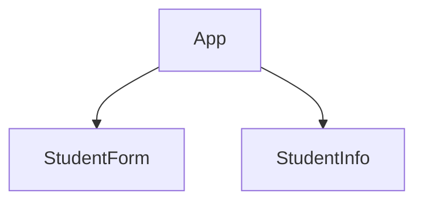
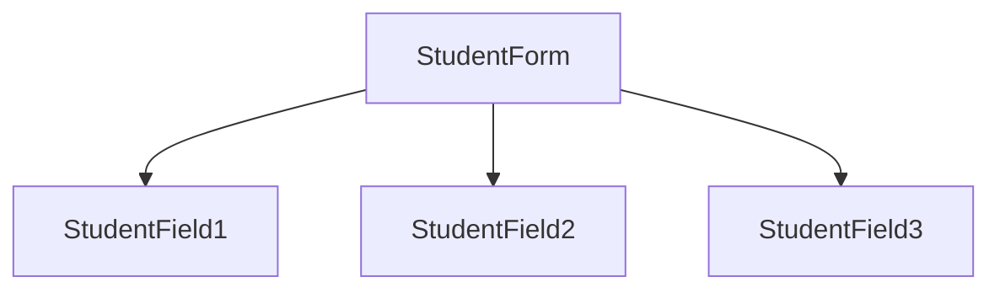

# Building a Student Form with React: A Step-by-Step Guide.
###### By Nikolaos Kladis.

### 1. Introduction

Hello! In this guide, we'll build a basic student form app from scratch. From inputting data to real-time validation and displaying results. This may seem an easy task, but it covers most of the ideas you need to work with complex projects. Let's dive into the code!

### 2. Problem Analysis



Our task involves creating a student form that is a separate component from the student's information output.


  

Upon completion the form is validated before the user can submit it. This is the expected output if the data is missing:


After successful validation of the form, the student's data are submitted and displayed next to the form: 


### 3. Application Setup

We start by initializing our react app on our local environment. Create a react app with vite: `npm create vite@latest student-form-app --template react`, cd into the app  and install the dependencies with `npm i`. Clear all the default code and start clean. Finally to see our interface in the browser run: `npm run dev`.

To set up our GitHub repo, run `git init` and then rename the master branch to main with `git checkout -m master main`, then `git add .` and `git commit -m "student-form-app | initial commit"`. This is our initial commit. If you have synced your GitHub account with VS Code, you can publish the repo by clicking "commit" button at the Source Control. 

### 4. StudentForm

#### 4.1 Basic Structure



We start by crafting our first component, which is the `<StudentForm />`. To organize  components, create a folder called `components`. 

Looking at the provided Image of our task, we notice that the `<StudentForm />` component consists of three input fields. These will be our `<StudentField />` sub-components. Instead of creating 3 different components, we will build one for reusability by passing **props** into them:

```jsx 
// StudentForm.jsx
const StudentForm  = () => {
	return (
		<form>
			<StudentField  label="First Name" type="text" />
			<StudentField  label="Last Name" type="text" />
			<StudentField  label="Email" type="email" />
		</form>
	);
};
```
```jsx
// StudentField.jsx
const StudentField  = ({ label, type }) => {
	return (
		<div>
			<label>{label, type}: </label>
			<input type={type} />
		</div>
	);
};
```
As we proceed we will make adjustments to add more complexity. While building our applications we structure our commits into smaller parts, so that our working history is easily followed. For example let's make a simple commit here: `git commit -m "student-form-app | added StudentForm & StudentField basic structure`. We can also checkout a new branch and then merge our code to our main. 

#### 4.2 State 

In order for us to track the changes that our students make on the form, we need to implement our **state** logic. We will examine two ways of doing this. Firstly we could create three different states for each `<StudentField />` like this:

```jsx
// StudentForm.jsx
const StudentForm  = () => {
	const [firstName, setFirstName] = useState('');
	const [lastName, setLastName] = useState('');
	const [email, setEmail] = useState('');
	
	return (
		<form>
			<StudentField  label="First Name"  type="text" value={firstName} />
			<StudentField  label="Last Name"  type="text" value={lastName} />
			<StudentField  label="Email"  type="email" value={email} />
		</form>
	);
};
```

The second way that we actually use is by creating a single state with an **object state** value and then updating the object's properties every time. By doing this our code becomes minimal and clear: 

```jsx
// StudentForm.jsx
const  initialState  = {
	firstName: "",
	lastName: "",
	email: "",
};

const StudentForm  = () => {
	const [state, setState] = useState(initialState);

	return (
		<form>
			<StudentField  label="First Name"  type="text"  value={state.firstName}  />
			<StudentField  label="Last Name"  type="text"  value={state.lastName}  />
			<StudentField  label="Email"  type="email"  value={state.email}  />
		</form>
	);
};
```

#### 4.3 Handlers

After deciding how to structure our state, we need to start implementing the **handling** logic of our state. Since we have an object state, we need to be careful with object mutations. To update the state of an object, we create a new state from copying the previous object values and editing the new values. This is called **object immutability**. It is generally suggested to never change any data directly.

We will create a `handleChange` that takes two parameters, the name of the property of our object and the value that changes the selected property's value of the object. It looks like this: 

```jsx
const  handleChange  = (field, value) => {
	setState((prevState) => ({
		...prevState,
		[field]: value,
	}));
};
```
For example, calling the `onChang`e event handler like this: `onChange={(e) =>  handleChange("firstName", e.target.value)}` will update the `firstName` property of the state with the value that the student has typed. Let's look at the bigger picture: 

```jsx
\\ StudentForm.jsx
const  initialState  = {
	firstName: "",
	lastName: "",
	email: "",
};

const  StudentForm  = () => {
	const [state, setState] =  useState(initialState);

	const  handleChange  = (field, value) => {
		setState((prevState) => ({
			...prevState,
			[field]: value,
		}));
	};

	return (
		<form>
			<StudentField
				label="First Name"
				type="text"
				value={state.firstName}
				onChange={(e) =>  handleChange("firstName", e.target.value)}
			/>
			<StudentField
				label="Last Name"
				type="text"
				value={state.lastName}
				onChange={(e) =>  handleChange("lastName", e.target.value)}
			/>
			<StudentField
				label="Email"
				type="email"
				value={state.email}
				onChange={(e) =>  handleChange("email", e.target.value)}
			/>
		</form>
	);
};
```
What we just did is to pass the `handleChange` function to our sub-component `<StudentField />` as props which looks like this: 

```jsx
// StudentField.jsx
const  StudentField  = ({ label, type, value, onChange }) => {
	return (
		<div>
			<label>{label}: </label>
			<input  type={type} value={value} onChange={onChange}  />
		</div>
	);
};
```
This way we pass the value of the object state and the method to change the value of the object without having a local state inside our sub-component. For further analysis, you can study the react docs on event handlers: https://react.dev/learn/responding-to-events.

#### 4.4 Submit

We use the `onSubmit` event handler inside the `<form />` component, and then `e.preventDefault()` to stop the default submit function. It looks like this:

```jsx
const  handleSubmit  = (e) => {
	e.preventDefault();
};

return (
	<form onSubmit={handleSubmit}>
		.
		.
		.
		<button type="submit">Submit</button>
	</form>
);
```
#### 4.5 Refactoring
When I started implementing the validation I faced a major problem. My first thought was to change the state structure in order to track the object properties that are missing, so here is what I wrote: 
```jsx
const  initialState  = {
	firstName: { value: "", isMissing: false },
	lastName: { value: "", isMissing: false },
	email: { value: "", isMissing: false },
};
```
The purpose of the `isMissing` property was to be props to the `<StudentField isMissing={state.firstname.isMissing}/>` section, when `isMissing === true`, then the sub-components outputs the error message. But to do this, I needed to implement a very difficult to read function that involved Object entries like this:

```jsx
const  handleSubmit  = (e) => {
	e.preventDefault();
	
	const  updatedState  =  Object.fromEntries(
		Object.entries(state).map(([field, { value }]) => [
			field,
			{ value, isMissing: value  ===  "" },
		])
	);
	
	setState(updatedState);
};
```
So I ditched the idea and decided to rewrite my state in an **array data structure** to  like this:
```jsx
const  initialState  = [
	{ name: "firstName", type: "text", value: "", isMissing: false },
	{ name: "lastName", type: "text", value: "", isMissing: false },
	{ name: "email", type: "email", value: "", isMissing: false },
];
```
This came with multiple benefits. I could now have my `<StudentField />` inside a map function and the code looked a lot cleaner. Now the rest of my code looked like this:

```jsx
const  StudentForm  = () => {
	const [state, setState] =  useState(initialState);
	
	const  handleChange  = (fieldName, value) => {
		setState((prevState) =>
			prevState.map((field) =>
			field.name  ===  fieldName  
				? { ...field, value, isMissing: false } 
				:  field
			)
		);
	};

	const  handleSubmit  = (e) => {
		e.preventDefault();
	};
	
	return (
		<form  onSubmit={handleSubmit}>
			{state.map((field) => (
				<StudentField
					key={field.name}
					label={field.name}
					type={field.type}
					value={field.value}
					onChange={(e) =>  handleChange(field.name, e.target.value)}
					/>
				))}
			<button  type="submit">Submit</button>
		</form>
	);
};
```
So the code looked a lot better. I conclude that the **data structure** of our data is very crucial to how we design our applications.

#### 4.6 Validation
After refactoring my code, the validation process became a lot easier. When the student submits the form, we map the state and if `field.value === ""` is equal with the empty char then we set the `isMissing = true`:
```jsx
const  handleSubmit  = (e) => {
	e.preventDefault();
	
	setState((prevState) =>
		prevState.map((field) => ({
			...field,
			isMissing: field.value  ===  "",
		}))
	);
};
```
When the `isMissing` changes, this triggers a re-render and the prop to the `<StudentField />` then with **conditional rendering** we get an error text <em>"This Field is Required"</em>:

```jsx
const  StudentField  = ({ label, type, value, onChange, isMissing }) => {
	return (
		<div>
			<label>{label}: </label>
			<input  type={type}  value={value}  onChange={onChange}  />
			{isMissing  &&  <p>This Field is Required</p>}
		</div>
	);
};
```
#### 4.7 Reducer

Finally we can implement our state and handlers into a **Reducer**. For this small project this may seem unnecessary, but we are doing this for learning purposes. First we create a new file called `studentFormReducer.jsx`, and we begin transferring our state logic inside the reducer function:

```jsx
export  const  initialState  = [
	{ name: "firstName", label: "First Name", type: "text", value: "", isMissing: false, },
	{ name: "lastName", label: "Last Name", type: "text", value: "", isMissing: false, },
	{ name: "email", label: "Email", type: "email", value: "", isMissing: false, },
];

export  const  studentFormReducer  = (state, action) => {
	switch (action.type) {
		case  "CHANGE":
			return  state.map((field) =>
				field.name  ===  action.fieldName
					? { ...field, value: action.value, isMissing: false }
					:  field
			);
		case  "SUBMIT":
			return  state.map((field) => ({
				...field,
				isMissing: field.value  ===  "",
			}));
		default:
			return  state;
	}
};
```
Now we have two actions, the `CHANGE` and the `SUBMIT`. This declutters our code so much, especially if we have more actions. We replace the `useState` with the `useReducer` hook,  then import the `studentFormReducer` and the `initialState`:
```jsx
import  React, { useReducer } from  "react";
import { studentFormReducer, initialState } from  "./studentFormReducer";

const  StudentForm  = () => {
	const [state, dispatch] =  useReducer(studentFormReducer, initialState);
	
	const  handleChange  = (fieldName, value) => {
		dispatch({ type: "CHANGE", fieldName, value });
	};

	const  handleSubmit  = (e) => {
		e.preventDefault();
		dispatch({ type: "SUBMIT" });
	};

...
```
When the `handleChange` or the `handleSubmit` functions are used, the `dispatch` calls the reducer function and the code runs equally as before.
### 5. StudentInfo
